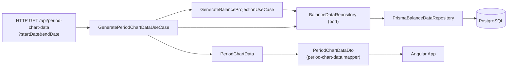

# Finance Domain Model

This document describes the business objects of the `finance` bounded context
(`packages/finance`), what problem each one solves, and how they collaborate to
answer the core question of the app: **"what will my balance be on a given
day?"**.

The package follows a simple ports & adapters layout:

```
packages/finance/src/lib
├── domain/           business objects and rules, no framework/IO dependency
├── application/      use cases and ports (interfaces) the domain layer depends on
└── infrastructure/   adapters implementing those ports (Prisma, in-memory)
```

## Domain objects

### `Money`

A value object representing an amount in a given `Currency`. Amounts are
stored internally as an integer number of **cents**, never as a floating
point number of euros — this avoids the rounding errors that accumulate when
doing repeated decimal arithmetic (e.g. `0.1 + 0.2 !== 0.3`).

- `Money.fromEuros(amount)` / `Money.fromCents(cents)` — the only ways to
  construct one (constructor is private).
- `add`, `subtract`, `multiply`, `invert` — return a new `Money`, and `add`/
  `subtract` throw if the two operands don't share the same `Currency`
  (`assertSameCurrency`).
- `isNegative()`, `toNumber()` (back to euros, for display/serialization),
  `toString()`, `equals()`.

Every other domain object that carries an amount (`BalanceMilestone`,
`CashVariation`, `DailyBalanceVariation`, `ProjectionPoint`) uses `Money`
rather than a raw `number`, so currency-safety and rounding are enforced in
one place.

### `Currency`

An enum of the currencies the system understands (`EUR` only today). It
exists mainly so `Money` can refuse to mix amounts expressed in different
currencies — extending multi-currency support starts here.

### `BalanceMilestone`

A **known, trusted balance at a point in time**: `id`, `date`, `balance`
(`Money`), optional `note`. It is the anchor a projection is computed from —
you cannot project a balance without a milestone at or before the start of
the requested period (see `BalanceProjection.balanceAt`). In practice this
is typically the last reconciled bank statement balance.

### `CashVariation`

A **one-off cash movement** on a specific date: `id`, `date`, `amount`,
`type` (`'income' | 'expense'`), `label`. `signedAmount()` folds the `type`
into the sign of the amount (expenses become negative), so consumers can
always just `Money.add()` the result without re-checking the type.

### `DailyBalanceVariation`

A **recurring change to the daily balance over a date range** — e.g. a
subscription, rent, or a daily allowance: `id`, `startDate`, `endDate`,
`dailyAmount`, `label`. The constructor rejects an `endDate` before
`startDate`. `totalImpact()` returns `dailyAmount × number of days` in the
full range (inclusive), while `BalanceProjection` prorates it for whatever
sub-range actually overlaps the requested projection window.

### `ProjectionPoint`

The smallest unit of output: an immutable `(date, balance)` pair — the
projected balance on one given day.

### `BalanceProjection`

The aggregate that knows **how to compute the balance at any date**, given
one `BalanceMilestone` (the anchor) plus the `CashVariation[]` and
`DailyBalanceVariation[]` relevant to the period:

- `balanceAt(date)` — starts from the milestone's balance, adds every
  `CashVariation` between the milestone's date and `date` (via
  `signedAmount()`), then adds every overlapping `DailyBalanceVariation`'s
  prorated contribution for the days it actually overlaps `[milestone.date,
  date]`.
- Throws if `date` is before the milestone's date — a projection only makes
  sense moving forward from its anchor.

### `BalanceProjectionGenerator`

A domain service that turns a single-date `BalanceProjection.balanceAt`
calculation into a **daily time series**:
`generateDailyProjection(projection, startDate, endDate)` walks every
calendar day in `[startDate, endDate]` (inclusive) and collects one
`ProjectionPoint` per day. This is what gives the API's balance projection
its one-day granularity, consumed as-is by the Angular line chart.

## Application layer

### `BalanceDataRepository` (port)

The interface the application layer depends on to fetch the raw ingredients
of a projection, without knowing whether they come from a database or
memory: `getLatestMilestoneBefore`, `getMilestonesBetween`,
`getCashVariationsBetween`, `getDailyVariationsOverlapping`. This
dependency-inversion boundary is what lets the use cases be unit-tested
without a real database.

### `GenerateBalanceProjectionUseCase`

Orchestrates the objects above to answer "what is the daily balance
projection between `startDate` and `endDate`?":

1. Fetch the nearest `BalanceMilestone` at or before `startDate` — fails
   with `"No milestone found before projection start date"` if none exists.
2. Fetch every `CashVariation` and `DailyBalanceVariation` overlapping
   `[milestone.date, endDate]`.
3. Build a `BalanceProjection` from those three ingredients.
4. Delegate to `BalanceProjectionGenerator` to produce the `ProjectionPoint[]`
   returned to the caller.

### `PeriodChartData` (not a domain object)

A display-oriented bundle for a requested `[startDate, endDate]` period,
meant to feed the chart rather than to model the business:
`balanceProjection` (the daily series from `GenerateBalanceProjectionUseCase`)
plus, scoped strictly to `[startDate, endDate]`, the raw events that
happened in it — `balanceMilestones`, `cashVariations` and
`dailyBalanceVariations`. This is what lets the chart later plot the exact
moment and amount of a milestone or variation instead of only the smoothed
daily balance line. It lives in the application layer (not `domain/`)
precisely because it isn't part of the business's ubiquitous language — it's
a query result shaped for one particular consumer (the UI).

### `GeneratePeriodChartDataUseCase`

Builds a `PeriodChartData` for `[startDate, endDate]`:

1. Delegates to `GenerateBalanceProjectionUseCase` for `balanceProjection`
   (reusing its milestone-anchoring logic as-is).
2. Fetches `balanceMilestones` via `getMilestonesBetween(startDate, endDate)`,
   `cashVariations` via `getCashVariationsBetween(startDate, endDate)` and
   `dailyBalanceVariations` via `getDailyVariationsOverlapping(startDate,
   endDate)` — all scoped to the requested period itself, unlike the wider
   `[milestone.date, endDate]` window `GenerateBalanceProjectionUseCase` uses
   internally to compute the running balance.
3. Wraps everything in a `PeriodChartData`.

## Infrastructure

### `InMemoryBalanceDataRepository`

A `BalanceDataRepository` backed by plain in-memory arrays, used to unit
test `GenerateBalanceProjectionUseCase` without a database (see
`generate-balance-projection.use-case.spec.ts`).

### `PrismaBalanceDataRepository`

The production `BalanceDataRepository`, backed by Prisma/PostgreSQL. It maps
Prisma's raw models (integer cents columns) back into domain objects via
`Money.fromCents(...)`, keeping the ORM's shape out of the domain layer.

## End-to-end flow

The Angular app currently calls `GET /api/period-chart-data`, which returns a
`PeriodChartData` covering the requested period:



The API's `PeriodChartDataDto` (`apps/api/src/app/dto/period-chart-data.dto.ts`)
and its mapper are the boundary that turns the `PeriodChartData` bundle
(and the `Money`/`Date` values inside it) into plain JSON — the domain and
application layers themselves never serialize anything.

`GET /api/projection` (`ApiEndpoints.Projections`) still exists, returning
just the `ProjectionPointDto[]` via `GenerateBalanceProjectionUseCase`, but
is currently unused by the frontend — kept around for now rather than
removed.
